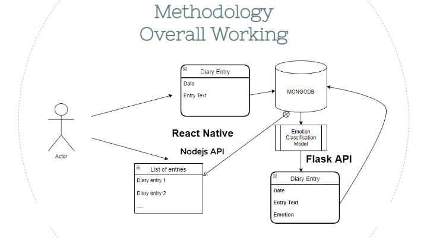
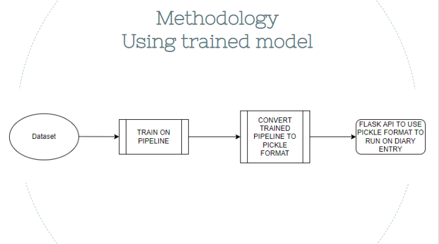

# Mobile and Pervasive Computing

Made by: Ridhima Kohli B19CSE071 and Shivam Kumar B19CSE118

## Instructor: Dr. Suchetana Chakraborty ( Department of Computer Science & Engineering @ Indian Institute of Technology, Jodhpur)

## Diary Entry Emotion Analysis

An application for users to enter their diary entries. The app detects the emotion - positive or negative based on the entry

## Techstack

- React Native
- NodeJS
- Python
- Flask
- MONGO DB

### Process followed 

1. Created a react native application
2. Created a database for storing the entries using MONGO DB
3. Created Node.js apis to handle the requests
4. Searched for datasets and used the dataset to train the model pipeline
5. Converted Pipeline to pickle format
6. Made flask API to use model on data stored in MONGO DB
7. Integrated Flask and NodeJS APIs
8. Developed logic and front end for application
9. Deployed the apis on heroku

## App Description

The app's working and demo can be found in the slides

Link to slides : [MPC Project](https://docs.google.com/presentation/d/1f2mYyiAzYdjQkzzTDimALybJ4XTBT45HEzP9w1_nOgQ/edit?usp=sharing)

Here is the flowchart for methodology

# How to run ?

- Download the code
-  Install expo on your mobile device
-  Download this repository on your PC
-  Run command `npm install`
-  Run command `npm start`
-  Go to localhost:19002 to see expo client 
-  Turn the option to Tunnel
-  Scan the QR code to run the application on your mobile phone
-  Alternatively , you can also run it on your browser 
